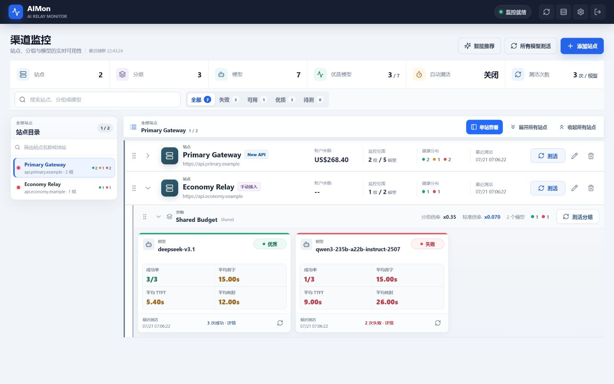
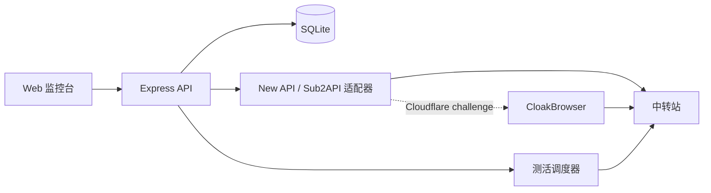

# AIMon

> 自托管的 AI 中转站渠道监控台：统一管理站点、分组和模型，并持续验证模型是否真实可调用。

[](https://nodejs.org/)
[](https://www.sqlite.org/)
[](./Dockerfile)

AIMon 支持 New API、Sub2API、Cloudflare 场景以及不登录站点的手动 API Key 接入。配置与测活记录保存在本地 SQLite 中，站点密码和 API Key 使用 AES-256-GCM 加密后落盘。



## 文档导航

- [核心能力](#核心能力)
- [界面与操作逻辑](#界面与操作逻辑)
- [快速部署](#快速部署)
- [首次使用](#首次使用)
- [测活行为](#测活行为)
- [指标说明](#指标说明)
- [Cloudflare 与 CloakBrowser](#cloudflare-与-cloakbrowser)
- [环境变量](#环境变量)
- [运维与备份](#运维与备份)
- [数据与安全](#数据与安全)
- [常见问题](#常见问题)
- [本地开发](#本地开发)

## 核心能力

- 自动识别 New API 与 Sub2API，包括常见的新旧登录页面和轻度魔改站点。
- 自动登录并读取账户余额、可用分组、分组倍率与模型列表。
- 遇到 Cloudflare challenge 时自动启用 CloakBrowser 会话。
- 支持手动接入多个分组：填写分组名、倍率和 API Key 即可，无需站点账号。
- 按 `分组名_Monitor` 查找、复用或创建监控专用 API Key。
- 建立“站点 → 分组 → 模型”三级监控结构，可展开、收起和手动排序。
- 支持全局、站点、分组和单模型四级测活。
- 每个模型可配置 1–10 次测活，默认 3 次。
- 同一站点最多并发测活 3 个模型，同一模型的多次请求严格串行。
- 支持分钟级自动测活，设置为 `0` 时关闭。
- 根据成功率、响应速度和标准倍率生成推荐排序，并可随时恢复手动顺序。
- 页面管理密码、登录会话、登录限流和可选 HTTP Basic Auth。
- SQLite 持久化，敏感字段使用 AES-256-GCM 加密。

## 界面与操作逻辑

AIMon 使用“**站点 → 分组 → 模型**”三级结构，但只为模型保留独立卡片：

- **站点层**采用连续列表，集中展示余额、监控范围、健康分布与最后测活时间。
- **分组层**采用扁平分区，展示远端倍率、标准倍率、模型数量和健康分布。
- **模型层**使用独立指标卡，集中展示成功率、平均首字、TTFT、总耗时和分次结果。

桌面端左侧站点目录会随页面滚动同步当前站点；单站模式下点击目录会直接切换并展开目标站点。手机和平板使用横向站点选择器和底部固定操作栏，避免站点较多时反复长距离滚动。

状态筛选会直接显示各等级的模型数量；顶部状态区会显示网络、任务进度和最近刷新时间。桌面端可在右上角切换舒适/紧凑密度，偏好只保存在当前浏览器中。站点远端信息同步异常会固定显示在站点行下方，不会只依赖短暂提示。

常用入口：

| 位置 | 作用 |
| --- | --- |
| 顶部“所有模型测活” | 测活全部已选模型，并刷新各自动登录站点的余额和分组倍率 |
| 站点“测活” | 测活本站所选模型，同时刷新本站余额和所选分组倍率 |
| 分组“测活分组” | 测活本组所选模型，同时刷新当前分组倍率 |
| 模型刷新图标 | 只测活当前模型 |
| “智能推荐” | 按成功率、响应性能与标准倍率重新展示模型顺序 |
| “单站查看” | 聚焦当前站点；再次选择同一站点会重新展开 |
| 展开/收起操作栏 | 批量更新站点及其分组，并保持当前阅读位置 |
| 顶部刷新图标 | 只刷新面板数据和任务状态，不发送模型测活请求 |
| 右上角密度图标 | 在桌面端切换舒适布局与紧凑布局 |

站点识别、Cloudflare 会话或模型获取耗时较长时，添加站点弹窗会持续显示已等待时间，并允许取消当前探测。配置提交阶段会锁定弹窗，避免保存到一半时产生不明确状态。

## 工作方式



常规页面与测活任务由单个 Node.js 进程和 SQLite 承载。CloakBrowser 只在 Cloudflare 场景中启用浏览器上下文，因此日常资源开销主要取决于站点数量、模型数量和自动测活频率；触发浏览器会话时会临时增加内存与共享内存占用。

## 快速部署

### Docker Compose

需要 Docker 24+ 和 Docker Compose。

```bash
git clone https://github.com/1467698764/AIMon.git
cd AIMon
cp .env.example .env
```

编辑 `.env`，至少设置：

```dotenv
AIMON_SECRET=替换为长期不变的随机字符串
AIMON_BOOTSTRAP_PASSWORD=首次登录使用的管理密码
```

可用以下命令生成 32 字节随机密钥：

```bash
openssl rand -hex 32
```

本机已安装 Node.js 22.5+ 时，可在启动前执行一次配置体检。该命令不会输出密码、密钥或代理凭据：

```bash
npm run doctor
```

启动服务：

```bash
docker compose up -d --build
```

打开 `http://服务器IP:8787`。

Docker Compose 升级前先在容器内创建一致性备份并复制到宿主机，再拉取和重建镜像：

```bash
docker compose exec aimon npm run backup -- --data-dir /app/data --output /tmp/aimon-backups
docker compose cp aimon:/tmp/aimon-backups ./backups
git pull
docker compose up -d --build
```

`./data` 会挂载到容器内的 `/app/data`。请备份整个 `data/` 目录，而不只是 SQLite 主文件，因为运行时可能同时存在 WAL 文件和 CloakBrowser 站点会话。

### 部署后检查

1. 访问 `/api/auth/status`，确认服务返回 JSON，而不是平台的 404 页面。
2. 打开面板并完成登录，添加一个测试站点后刷新页面，确认配置仍然存在。
3. 重启或重新部署一次服务，再次确认配置未丢失；这一步能最早发现持久卷挂载错误。
4. 在公网域名上确认 HTTPS 生效，并检查浏览器没有混合内容警告。

也可以从任意安装了 Node.js 22.5+ 的机器执行自动检查：

```bash
npm run smoke -- https://aimon.example.com
```

如果启用了 HTTP Basic Auth，先在执行环境中设置 `AIMON_BASIC_USER` 和 `AIMON_BASIC_PASSWORD`。检查程序只会确认首页、鉴权状态接口、禁止缓存策略和安全响应头，不会读取站点配置或 API Key。

升级前建议先复制完整的 `data/` 目录和当前 `AIMON_SECRET`。升级后若出现异常，可同时恢复二者；只恢复数据库或只恢复密钥都不足以解密原有凭据。

### Zeabur

1. 在 Zeabur 新建项目并连接本仓库。
2. 使用仓库中的 `Dockerfile` 创建服务。
3. 创建持久卷，将 **Mount Directory** 设置为 `/app/data`。
4. 设置长期不变的 `AIMON_SECRET`。
5. 建议设置 `AIMON_BOOTSTRAP_PASSWORD`，避免公网首次打开时由访问者抢先创建管理密码。
6. 部署完成后绑定域名并启用 HTTPS。

Docker 镜像默认启用 `REQUIRE_PERSISTENT_DATA=true`。如果 `/app/data` 没有位于真实挂载卷中，AIMon 会拒绝启动，避免配置在重新部署后消失。

Zeabur 首次挂载卷可能清空目标目录。若服务已经在临时文件系统中运行过，请先导出原 `/app/data`，挂载持久卷后再导入。

## 首次使用

### 1. 登录面板

如果设置了 `AIMON_BOOTSTRAP_PASSWORD`，直接使用该密码登录。

如果没有设置，第一次打开页面时需要创建管理密码。管理密码至少 8 个字符，可在“默认配置”中修改。修改后，其他旧会话会立即失效。

### 2. 配置默认站点账号

在右上角“默认配置”中可以填写所有自动登录站点共用的账号和密码。

添加站点时也可以填写站点专用账号。站点专用账号为空时使用默认账号；两处都未配置时，自动登录模式会明确报错。

当编辑站点并修改 Base URL 时，必须重新填写站点凭据，或明确选择默认凭据。AIMon 不会把旧域名的站点密码自动发送到新域名。

### 3. 添加站点

#### 自动登录

填写站点名称、Base URL、可选站点账号密码和充值比例。AIMon 会：

1. 规范化 Base URL。
2. 识别 New API 或 Sub2API。
3. 登录并读取余额、分组与倍率。
4. 让你选择需要监控的分组。
5. 为每个分组复用或创建监控 Key。
6. 获取该 Key 实际可用的模型。
7. 让你选择需要监控的模型。

Base URL 推荐填写站点根地址，例如：

```text
https://api.example.com
```

填写 `https://api.example.com/v1` 或 `/api/v1` 也可以，AIMon 会自动归一化。Base URL 不允许包含用户名、密码、查询参数或非 HTTP(S) 协议。

#### 手动 API Key

无法登录、启用了 2FA、存在人工验证码或站点魔改较大时，选择“手动 API Key”。

每个站点可填写多个分组，每组包含：

- 分组名称
- 分组倍率
- API Key

AIMon 会直接通过通用 AI 接口获取模型。手动接入不会登录站点，也不会自动同步余额、远端分组名或倍率。

### 4. 保存或保存并测活

- **保存**：仅保存站点配置。
- **保存并测活**：保存后立即测活该站点所有已选模型。

再次编辑站点时，已有分组和模型会保持选中；新发现的分组默认不选，避免意外扩大监控范围。

## 测活行为

每次测活会向模型发送一个极短请求。AIMon 会根据模型端点类型使用 Chat Completions、Responses、Embeddings、Images、Rerank、Anthropic Messages 或 Gemini Generate Content。

对于常规 OpenAI 兼容模型：

1. 优先请求流式 `/v1/chat/completions`。
2. 不支持 SSE 时回退非流式 Chat Completions。
3. 明确不支持 Chat Completions 时回退 `/v1/responses`。

刷新范围规则：

| 测活入口 | 刷新分组倍率 | 刷新账户余额 |
| --- | --- | --- |
| 单模型 | 否 | 否 |
| 分组 | 当前分组 | 否 |
| 站点 | 站点全部已选分组 | 是 |
| 所有模型 | 各站点全部已选分组 | 是 |

手动 API Key 站点始终保留本地填写的倍率和分组信息。

## 指标说明

平均值只统计成功的测活请求；失败请求仍计入成功率并保留独立错误信息。

| 指标 | 含义 |
| --- | --- |
| 成功率 | 成功次数 / 本轮总测活次数 |
| 平均首字 | TTFB，从发出请求到收到首个响应字节 |
| 平均 TTFT | 从发出请求到收到首个非空文本 token |
| 平均耗时 | 从发出请求到响应读取完成 |
| 标准倍率 | 分组倍率 ÷ 充值比例 |

TTFT 只适用于能够观察到文本流的请求。非流式请求、Embedding、图片等端点可能显示 `--`，这不表示请求失败。

默认色标：

| 指标 | 绿色 | 黄色 | 红色 |
| --- | --- | --- | --- |
| 平均首字 | `< 7s` | `7s – < 15s` | `≥ 15s` |
| 平均 TTFT | `< 2s` | `2s – < 6s` | `≥ 6s` |
| 平均耗时 | `< 6s` | `6s – < 20s` | `≥ 20s` |

测活结果按成功比例分级：

- **优质**：全部成功。
- **可用**：成功次数不少于总次数的三分之二。
- **失败**：低于三分之二。
- **待测**：当前配置尚无有效测活记录。

默认测活 3 次时，对应为 `3/3` 优质、`2/3` 可用、`0–1/3` 失败。

## 推荐排序

推荐排序综合考虑：

- 成功率
- TTFT
- 总耗时
- 标准倍率

成功率是主要权重。动态倍率分组没有稳定的标准倍率，因此不参与价格权重。推荐排序只改变当前展示顺序，不会覆盖用户保存的手动排序；再次点击按钮即可恢复。

## Cloudflare 与 CloakBrowser

普通请求遇到 Cloudflare challenge 后，AIMon 会尝试：

1. 建立持久 CloakBrowser 站点会话。
2. 使用浏览器 Cookie 和 User-Agent 重试 Node 请求。
3. 仍被拦截时改用浏览器内同源请求。
4. New API 或 Sub2API 登录遇到 Turnstile 时使用浏览器登录流程。

托管 Turnstile 通常可以自动处理。需要人工点击、图片识别或其他交互的验证码不会被绕过，请改用手动 API Key 模式。

若设置 `CLOAKBROWSER_PROXY`，所有远端请求都会通过浏览器代理发送，避免代理 IP 与 Cloudflare 会话 IP 不一致。代理 URL 可能包含凭据，应将 `.env` 按敏感文件保护。

## 环境变量

| 变量 | 默认值 | 说明 |
| --- | --- | --- |
| `PORT` | `8787` | HTTP 服务端口 |
| `DATA_DIR` | `./data` | SQLite、草稿和 CloakBrowser 站点会话目录 |
| `REQUIRE_PERSISTENT_DATA` | 本地 `false`，镜像 `true` | 要求 `DATA_DIR` 位于 Linux 独立挂载卷 |
| `AIMON_SECRET` | 仅开发环境有回退值 | 本地敏感字段加密密钥；生产必须设置且不可随意更换 |
| `AIMON_BOOTSTRAP_PASSWORD` | 空 | 数据库没有管理密码时自动初始化，至少 8 个字符 |
| `AIMON_BASIC_USER` | 空 | 可选 HTTP Basic Auth 用户名 |
| `AIMON_BASIC_PASSWORD` | 空 | 可选 HTTP Basic Auth 密码，必须与用户名同时设置 |
| `REQUEST_TIMEOUT_MS` | `30000` | 单次远端请求超时，单位毫秒 |
| `AIMON_ALLOW_PRIVATE_NETWORK` | 生产环境 `false` | 是否允许访问回环、私网和云元数据地址；仅在确需监控受信内网服务时开启 |
| `CLOAKBROWSER_ENABLED` | `true` | 遇到 Cloudflare challenge 时启用浏览器会话 |
| `CLOAKBROWSER_HEADLESS` | `true` | 是否使用无头浏览器 |
| `CLOAKBROWSER_TIMEOUT_MS` | `60000` | 建立浏览器会话和等待 challenge 的超时 |
| `CLOAKBROWSER_IDLE_MS` | `180000` | 空闲浏览器上下文回收时间，最低 60000ms |
| `CLOAKBROWSER_MAX_CONTEXTS` | `2` | 同时保留的站点浏览器上下文数量 |
| `CLOAKBROWSER_PROXY` | 空 | 可选 HTTP 或 SOCKS5 代理 |
| `CLOAKBROWSER_BINARY_PATH` | 自动发现 | 可选 Chrome/Chromium 可执行文件路径 |
| `CLOAKBROWSER_AUTO_UPDATE` | `false` | 是否允许 CloakBrowser 运行时自动更新 |
| `CLOAKBROWSER_LICENSE_KEY` | 空 | 可选 CloakBrowser Pro 授权 |

自动测活间隔和每模型测活次数存储在数据库中，请在页面“默认配置”里修改，而不是通过环境变量配置。

## 运维与备份

### 配置体检

`npm run doctor` 会检查 Node.js 版本、环境变量格式、密钥强度、Basic Auth 配对、`DATA_DIR` 可写性，以及 `.env` / `data/` 是否已被 Git 忽略。建议在首次部署和每次修改环境变量后执行。检查结果中的敏感值始终隐藏。

### 一致性备份

运行中的 SQLite 可能同时存在 WAL 和 SHM 文件，直接单独复制 `aimon.sqlite` 不能保证得到一致快照。仓库提供的备份命令使用 SQLite Backup API 创建一致数据库副本，并复制 `DATA_DIR` 内的 CloakBrowser 会话等辅助文件：

```bash
npm run backup
```

默认产物位于 `./backups/aimon-backup-时间/`。也可以指定路径：

```bash
npm run backup -- --data-dir /app/data --output /tmp/aimon-backups
```

备份目录必须位于 `DATA_DIR` 之外，避免递归复制和把备份留在同一故障卷。产物中的 `manifest.json` 不包含 `AIMON_SECRET`；请把当时使用的 `AIMON_SECRET` 单独保存在密码管理器中。

Docker Compose 部署可先在容器内生成，再复制到宿主机：

```bash
docker compose exec aimon npm run backup -- --data-dir /app/data --output /tmp/aimon-backups
docker compose cp aimon:/tmp/aimon-backups ./backups
```

### 恢复与回滚

1. 停止 AIMon，避免恢复过程中产生新写入。
2. 保留当前 `data/` 作为回滚副本。
3. 将备份目录内容恢复到空的 `DATA_DIR`。
4. 恢复与该备份配套的 `AIMON_SECRET`。
5. 启动服务，执行 `npm run smoke -- URL`，再登录确认站点和测活记录。

不要把新数据库与旧 WAL/SHM 文件混用。恢复到空目录可避免 SQLite 读取不属于该快照的日志文件。数据库迁移在启动时自动执行，因此备份可以升级到新版；降级到旧版本前应先确认旧版数据库结构兼容。

### Zeabur 升级清单

1. 确认 `/app/data` 持久卷状态正常，并记录当前部署版本。
2. 导出一致性备份并单独确认 `AIMON_SECRET` 可取回。
3. 触发 GitHub 自动部署，等待容器健康检查通过。
4. 执行烟雾检查并登录确认配置、余额和最近测活记录。
5. 出现数据库兼容问题时，同时回滚镜像、数据快照和对应密钥。

## 数据与安全

`DATA_DIR` 中包含：

- `aimon.sqlite` 及 SQLite WAL 文件
- 加密后的站点账号、密码和 API Key
- 管理密码强哈希和登录会话
- `cloak-profiles/` 中的站点浏览器会话

注意事项：

- 备份和恢复时应复制整个 `DATA_DIR`。
- `AIMON_SECRET` 必须与数据库一起备份；更换后旧凭据无法解密。
- 不要提交 `.env`、`data/`、`backups/` 或浏览器会话到 Git；仓库已默认忽略这些路径。
- 公网部署必须使用 HTTPS。
- 建议额外使用 HTTP Basic Auth、Cloudflare Access、VPN 或反向代理访问控制。
- AIMon 允许管理员配置任意 Base URL，因此具备访问服务器所在网络的能力。只向可信管理员开放面板，并使用防火墙限制敏感内网。
- 生产环境默认拦截回环、私网和云元数据地址，降低 SSRF 风险。开启 `AIMON_ALLOW_PRIVATE_NETWORK=true` 后，应通过防火墙进一步隔离云元数据服务和其他敏感网段。
- 当前并发控制基于单 Node.js 进程。请使用单实例部署，不要让多个副本共享同一个 SQLite 目录。

## 常见问题

### 重新部署后配置消失

`/app/data` 没有挂载持久卷，或持久卷挂载到了错误目录。Zeabur 的 Mount Directory 必须精确为 `/app/data`。

### 修改 `AIMON_SECRET` 后无法读取凭据

恢复原来的 `AIMON_SECRET`。该值是加密数据的一部分，不能像普通登录密码一样直接轮换。

### 无法识别或登录站点

1. Base URL 尽量填写站点根地址。
2. 检查站点账号密码或默认账号密码。
3. 确认账号没有启用 TOTP/2FA。
4. 查看是否出现 Cloudflare 或验证码提示。
5. 仍失败时使用手动 API Key 模式。

### Cloudflare 一直失败

确认 CloakBrowser 已启用、服务器共享内存充足，并适当提高 `CLOAKBROWSER_TIMEOUT_MS`。如果站点要求人工验证码，直接使用手动 API Key 模式。

### 模型列表为空

确认对应 API Key 有权调用 `/v1/models`，并检查站点是否为模型列表接口做了特殊魔改。

### TTFT 显示 `--`

该请求可能是非流式响应，或者属于 Embedding、图片等没有文本 token 的端点。查看成功率和平均耗时判断请求是否成功。

### 启动时报持久卷错误

Docker 镜像检测到 `/app/data` 不在独立挂载卷中。正确挂载卷后重新部署。只有在明确确认宿主机目录会持久保存时，才应设置 `REQUIRE_PERSISTENT_DATA=false`。

## 本地开发

需要 Node.js 22.5+，推荐 Node.js 24。

```bash
npm install
npm run dev
```

- 前端开发地址：`http://localhost:5173`
- API 地址：`http://localhost:8787`

质量检查：

```bash
npm run typecheck
npm test
npm run build
```

`npm run doctor` 面向部署环境，会读取当前环境变量或项目根目录的 `.env`；未配置生产密钥时返回失败属于预期行为。

生产运行：

```bash
npm run build
AIMON_SECRET=use-the-same-64-character-secret-from-your-password-manager NODE_ENV=production npm start
```

Windows PowerShell：

```powershell
$env:AIMON_SECRET = "use-the-same-64-character-secret-from-your-password-manager"
$env:NODE_ENV = "production"
npm run build
npm start
```

## 当前限制

- 自动登录不支持启用了 TOTP/2FA 的远端账号。
- 无法可靠处理必须人工完成的验证码。
- 高度魔改的 New API/Sub2API 可能需要使用手动 API Key 模式。
- New API 分组改名无法百分之百自动识别；AIMon 只复用能够可靠关联的监控 Key。
- 仅支持单实例部署和本地 SQLite，不提供多节点任务协调。
