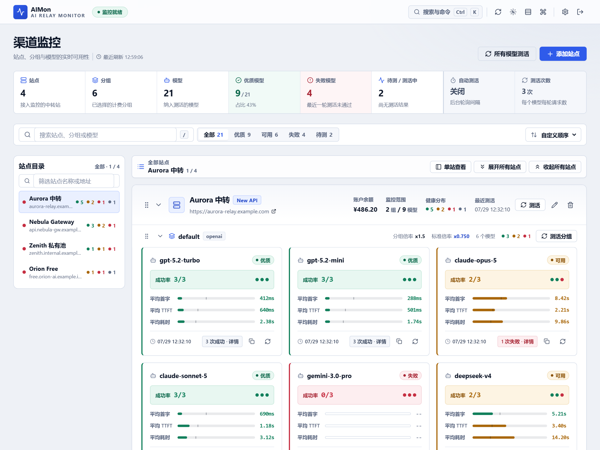
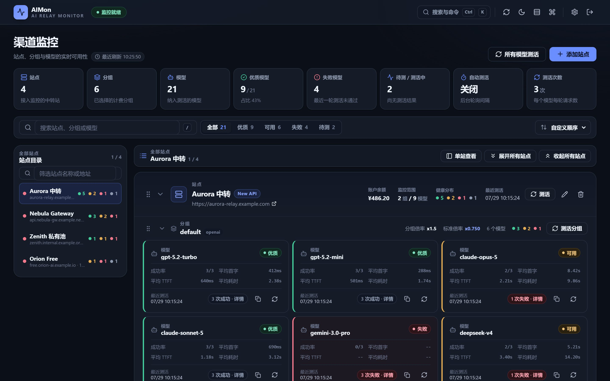
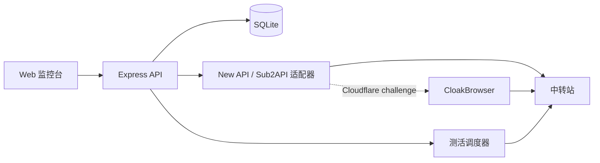

# AIMon

> 自托管的 AI 中转站渠道监控台：统一管理站点、分组和模型，并持续验证模型是否真实可调用。

[](https://nodejs.org/)
[](https://www.sqlite.org/)
[](./Dockerfile)

AIMon 支持 New API、Sub2API、Cloudflare 场景以及不登录站点的手动 API Key 接入。配置与测活记录保存在本地 SQLite 中，站点密码和 API Key 使用 AES-256-GCM 加密后落盘。



面板支持浅色、深色和跟随系统三种主题：



## 文档导航

- [核心能力](#核心能力)
- [界面与操作逻辑](#界面与操作逻辑)
- [键盘快捷键与命令面板](#键盘快捷键与命令面板)
- [快速部署](#快速部署)
- [首次使用](#首次使用)
- [测活行为](#测活行为)
- [指标说明](#指标说明)
- [排序方式](#排序方式)
- [Cloudflare 与 CloakBrowser](#cloudflare-与-cloakbrowser)
- [环境变量](#环境变量)
- [运维与备份](#运维与备份)
- [数据与安全](#数据与安全)
- [常见问题](#常见问题)
- [本地开发](#本地开发)

## 核心能力

- 自动识别 New API 与 Sub2API，包括常见的新旧登录页面和轻度魔改站点。
- 自动登录并读取账户余额、可用分组、分组倍率与模型列表。
- 遇到 Cloudflare challenge 时自动启用 CloakBrowser 会话。
- 支持手动接入多个分组：填写分组名、倍率和 API Key 即可，无需站点账号。
- 支持登录域名与 API 域名分离：登录、分组和 Key 走登录域名，模型列表与测活走 API 域名。
- 按 `分组名_Monitor` 查找、复用或创建监控专用 API Key。
- 建立“站点 → 分组 → 模型”三级监控结构，可展开、收起和手动排序。
- 支持全局、站点、分组和单模型四级测活。
- 四级测活都可以改用自定义问题，并在详情里保留每次请求的模型回复原文；常用问题可以保存、编辑和删除。
- 每个模型可配置 1–10 次测活，默认 3 次。
- 单次测活超时可在“默认配置”里设置，默认 300 秒（可填 10–1800 秒）：推理模型只是思考就可能超过 160 秒，超时过短会把慢模型直接判成失败。
- 同一站点最多并发测活 3 个模型，同一模型的多次请求严格串行。
- 支持分钟级自动测活，设置为 `0` 时关闭。
- 根据成功率、响应速度和标准倍率生成推荐排序，也可按响应速度、成功率或名称排序，并随时恢复手动顺序。
- 浅色 / 深色 / 跟随系统主题，舒适与紧凑两种密度，偏好保存在本地浏览器。
- 命令面板（`Ctrl`/`⌘` + `K`）与全键盘操作，覆盖测活、视图、排序、筛选和站点跳转。
- 页面管理密码、登录会话、登录限流和可选 HTTP Basic Auth。
- SQLite 持久化，敏感字段使用 AES-256-GCM 加密。

## 界面与操作逻辑

AIMon 使用“**站点 → 分组 → 模型**”三级结构，一个站点就是一块面板，三层都在这块面板里：

- **站点层**是一块带框的面板：面板顶部一条比页面更深的标题带，集中展示余额、监控范围、健康分布与最后测活时间，站点名是全页除应用标题以外最大的字（20px）。
- **分组层**是面板里一条通栏的下沉横条：上下各一条发丝线，左缘一道品牌色的标签边，行首一枚写着“分组”的标签，组名 15px 加粗，右侧是远端倍率、标准倍率、模型数量和健康分布。横条是通栏而不是内缩的——内缩一圈就会变成第三种卡片。
- **模型层**是全页唯一保留的卡片，也是这条阶梯里最浅的一层，而且是全页唯一拥有渐变底面的物件：卡内只有三段——第一段是模型名、逐次结果圆点和带成功分数（`2/3`）的状态徽章，第二段把平均首字、平均 TTFT 和平均耗时排成三行，每行自己又占两行：标签与数值一左一右，指标条通栏压在它们下面，因此不必读完数字就能判断模型快慢，第三段是最近测活时间与四个操作。卡片边框只在整轮失败和测活进行中变色。

三级结构的每一层都有一层自己的底色，而且这条阶梯只朝一个方向走：**底色越深，层级越高**——站点标题带最深，分组横条次之，面板地板就是画布色，模型卡片最浅。深色主题把染色方向倒过来（标题带最暗），规则不变。上一版走的是另一条路：除模型卡片以外的容器全部去掉边框和底色，只靠标题字号和发丝线交代层级，结果是分组标题和站点标题成了同一种裸行，不读文字就分不清自己在看站点还是在看分组。补救的办法不是把四层框再套回去（那正是当初拉平的原因），而是给每层一层底色，再各配一个独有的记号：站点有框、有标题带、有最大的字；分组有下沉底、有上下发丝线、有品牌色标签边和“分组”二字；模型有自己的边框、接触阴影、最浅的底色和一张渐变面。

搜索、状态筛选、排序和视图控制合并为站点列表上方的**同一条吸顶工具条**：第一行是搜索框、按状态分档的筛选器和当前显示的站点数量，第二行是当前站点范围、排序方式与单站 / 全部视图和展开 / 收起按钮。两者原先是上下两张独立卡片，读起来像两条互相竞争的工具栏，也把第一个站点面板挤到首屏之外。工具条的实际高度会实时发布给站点目录和“滚动到站点”的偏移量，因此换行后不会盖住它下方的内容。

桌面端左侧站点目录是一条贴在画布上的窄导轨（216px），不带自己的边框、底色和阴影：一列站点名旁边紧挨着它所导航的面板，再套一层卡片框只会让整页看起来又多了一张卡，而一条只放站点名的侧栏也不需要和内容列一样宽。目录会随页面滚动同步当前站点，并在每个站点右侧显示健康分布；当前站点用品牌浅底和品牌色站点名标出，与页面上其他“已选中”的控件是同一种语言，悬停只轻微加深底色。单站模式下点击目录会直接切换并展开目标站点。窄屏把站点目录改为横向选择器，只保留失败数量——站点圆点取最差状态，单看颜色无法区分“一个模型挂了”和“整站挂了”；横向选择器需要吸顶，因此在窄屏下它会重新获得一层底色，避免页面内容从它下面穿过。窄屏下吸顶工具条改为随页滚动，由横向站点选择器承担导航，避免两条吸顶元素争抢同一位置；工具条内的按钮换行显示而不横向滚动，避免按钮文字被截断成半个词。

状态筛选会直接显示各等级的模型数量；标题栏的状态胶囊汇总网络、任务进度和错误，最近刷新时间显示在页面标题下方。测活进行中会出现独立任务条，显示当前目标、已完成数量和排队数量。搜索栏上方原先还有一条八格数据概览，已经移除：那些数字在站点行、分组行和状态筛选里都能读到，却先占掉一屏高度，并且又是一张需要跨过的卡片。

视觉上采用“克制圆角 + 中性控件 + 短接触阴影”的语言。圆角逐层收敛但整体偏紧：浮层与站点面板 14px，模型卡片 10px，按钮与输入框 8px，标签 4px，胶囊形只留给真正是胶囊的东西——状态徽章、指标条和进度条；仪表盘本身密集且方正，过大的曲率会吃掉每个面板的边角，也会让小控件看起来像药丸。除了下文那份点名的清单以外，控件一律是一张中性底面加一条发丝描边，不带竖向高光，也不在悬停时上浮：整排渐变按钮会像一排压花塑料件，让控件看起来可按的是它与身后底色的对比，而不是自身的高光。渐变分两种用法，互不越界：**控件**上的实心渐变是稀缺资源，只发给身份物件、全页唯一的主按钮和“正在进行”的东西——发得越少，它每次出现时说的话越重；**大面积的底**（吸顶工具条、面板地板、标题带、分组横条、弹窗，以及模型卡片自己的面）则一律带一层同一支光谱的染色，因为一块几百像素宽的纯色面在染色的画布上只会读成一张发白的板。

有框的东西只有两类：站点面板和模型卡片。吸顶工具条和站点目录仍然只用发丝线和留白交代边界——它们是导航，不是内容。站点面板的地板直接用画布色，所以面板是靠一圈边框而不是靠第二层灰底被认出来的，压在上面的卡片也保持原来的对比度。画布不再是一块纯色板，而是一层**会呼吸的底**：一张 72px 的网格钉死在视口上（`background-attachment: fixed`），网格线只有百分之几的不透明度，滚动时不跟着页面走，因此它读起来是仪表盘背后的坐标纸而不是一层贴在内容上的花纹；网格之上是三团巨大的高斯模糊光斑（“极光”），固定在视口上、`z-index: -1`，以 34s / 46s 两条错开的循环缓慢漂移。极光只动 `transform`，因此每团光斑各占一个合成层，页面在它呼吸时不重排也不重绘；`prefers-reduced-motion` 会把它冻在第一帧。这层底不会破坏层级阶梯：站点面板、模型卡片和标题带用的都是不透明的底色令牌，极光只在面板之间的画布上透出来。早先那层顶部 420px 的渐变正相反——它顺着页面变浅，在页面上横切出一条明显的接缝，而面板地板正是贴着画布读的。吸顶工具条用的是**画布色**的毛玻璃而不是面板色：它是一条带子，不是一张卡片，浅色毛玻璃压在画布上时看起来像一张横在标题和第一个站点之间的宽卡片，正是它本不该有的割裂感；标题栏则单独用面板色毛玻璃，与它下方的带子区分开。工具条身上再压一层可读强度的渐变薄雾（`--grad-wash`）而不是只有几个百分点的那一层——它是首屏最宽的一块面，几个百分点在它身上只会读成一张发白的磨砂板。两条吸顶带子的下边缘都是一条渐变发丝线，而不是一条灰线。

按钮有三种底面，靠**颜色**而不是明度区分层级：全屏唯一的渐变实心主按钮（当前唯一的提交动作，也是全页唯一允许发光的控件），各级“测活”入口共用的品牌浅底（这个工具存在的目的就是测活，它值得和主按钮同一个色系，但不必喊得一样响），以及其余控件共用的中性底面。之前整套控件全部退成灰阶，一屏灰白页面上只剩明度可以区分层级，读起来不像克制，而像没做完。中性这一档也不是灰的：它保持中性的底色和发丝边，但底面本身压着同一支光谱的一层薄染（`--grad-control`，悬停时加深到 `--grad-control-hover`），因此普通按钮、图标按钮和卡片上的“详情”入口读起来是这台控制台的一部分，而不是一排贴在页面上的通用灰件——标题栏那排图标按钮曾是全页最后剩下的一片纯灰方块。输入型控件（搜索框、下拉、分段控件、文本框、`kbd`）使用比按钮更浅的下沉底面，薄染也用最淡的一档（`--grad-field`）——输入框是一个可以往里打字的洞，按钮是一张可以按下去的面，洞可以接到这层光，但必须比面低一档。幽灵按钮（取消 / 返回）不填充；处于开启状态的开关、分段控件里被选中的段、命令面板的键盘光标、被勾选的模型和被选中的常用问题，全部使用同一枚品牌浅底，因此“这一个是选中的”在整个应用里只有一种写法。品牌浅底、幽灵、危险和主按钮这四种变体都不带薄染：`background` 简写会清掉 `background-image`，所以需要保持纯色的那几档要么用简写，要么显式写 `background-image: none`。

配色是一套**以深色为主的冷调控制台**：深色主题的画布是接近午夜的蓝黑（`#070a16`），面板与卡片沿着同一支蓝往上抬，墨色是偏蓝的白；浅色主题不是纯白办公纸，而是一条**带蓝的冷灰阶梯**：画布 `#e3e8fa`，站点标题带 `#ccd5f0`，分组横条 `#d9dff5`，模型卡片 `#f7f9ff`，纯白只留给必须浮在染色页面之上的浮层。上一版浅色是 `#eceffa` 的画布配纯白卡片：四层声明出来的层级全部落在八个明度点之内，读起来不是四层，而是一整片白蒙蒙的雾，所以这条阶梯被拉开到 `#ccd5f0 → #f7f9ff`，每一档都带彩度，并且没有一块大面积底色是纯白。品牌色是靛蓝（浅色 `#4f46e5`，深色主题换成更亮的一档 `#93a4ff` 并配浅蓝墨色）。上一版试过暖调的“纸与墨”——沙色画布、米白卡片、酒红品牌色，那套配色本身没问题，但它给一台 AI 中转监控台穿了一身古典衣服：这一页要说的是延迟、并发和吞吐，不是纸墨。状态色取三档能当小字读的高饱和：翡翠绿、琥珀黄、玫瑰红，只有指标条上的黄档例外，改用更鲜艳的一级——黄色暗到能读小字时天生是棕的，当成一条条填充的横条时看起来像旁边绿条边上的一摊泥，而一条横条不必承担字形。状态色仍然只服务两件事：健康度（徽章、逐次圆点、成功分数和指标条用绿 / 黄 / 红 / 灰）和“链接 / 聚焦 / 正在进行”（测活进行中的卡片、任务条、运行状态胶囊和进度条转品牌色）。平台标签这类“事实”保持中性，避免和旁边的健康色抢读。阴影短、紧、偏冷，卡片读起来像一块压在画布上的面板；只有主按钮和身份色块额外带一圈品牌色的外发光。

“炫彩”只允许有**一支光谱**，写在令牌里，所有渐变都从它取色：`--grad-brand`（青 → 靛 → 品红，用在承载文字的实心面上，因此三个停靠点都刻意压深，白字才压得住）、`--grad-brand-hover`、`--grad-accent`（纯装饰用的霓虹一档）、`--grad-text`（`background-clip: text`）、`--grad-line`（发丝线）、`--grad-veil`（只有几个百分点的薄雾）、`--grad-wash`（同一支雾的可读强度，给那些否则就是一张平板的大面积底：吸顶工具条、站点面板地板、站点标题带、分组横条和弹窗）、`--grad-control` / `--grad-control-hover`（中性控件底面的薄染，见上）、`--grad-field`（输入型控件那一档最淡的薄染）、`--grad-card`（模型卡片自己的面，见下）。发出去的地方是一份点名的清单，不是“凡是渐变都能用”：应用标题与页面标题（`渠道监控`）用光谱做字色；三枚身份色块——应用图标、站点图标、登录页锁形图标——用光谱做底并带外发光；全页唯一的主按钮、层级标签和弹窗步骤指示器同样；标题栏、吸顶工具条、站点面板、弹窗、命令面板和登录卡的顶边各是一条渐变发丝线；分组横条的左缘是一道品红到青的竖边。凡是“正在进行”的东西，它的那条边会**扫动**（`aimon-sweep`，背景位置从 0% 走到 200%）：任务条顶边、进度条本身、正在测活的模型卡顶边、搜索框的待检索下划线。反过来，排队中的卡片只把边框染上品牌色而不扫动——排队不是运动。半透明的浅底上不放渐变描边：深色主题的 `--brand-soft` 是半透明的，`border-box` 渐变会从整块底色里透出来，而不是留在那 1px 的边上；这也是“测活”按钮和运行状态胶囊保持纯色浅底的原因。

模型卡片是全页唯一拥有**渐变底面**的物件：`--grad-card` 是沿着这支光谱斜着走的四档——左上角是白（深色主题是近黑），往右下依次染上青、靛、品红，悬停时同一条对角线再深一档。别处的渐变都是一层压在纯色上的薄雾，只有这里是底色本身，因为卡片是这一页真正被读、被比较、被操作的那个东西；一张纯白卡片压在染色的页面上，正是“白蒙蒙”里最响的那一块。除了这张面以外，卡片上的颜色只留在真正表示状态的地方。它原先同时有一条顶边色带、一圈按状态着色的边框、一条着色的成功率带、三个着色的数值和三条着色的指标条：四种颜色的卡框在一屏里同时出现时，健康的多数被画得和唯一那个不再回话的模型一样响，而“一次失败”还会把最安静的“详情”按钮染成整张卡上最红的东西。现在色带去掉，边框只在整轮失败（红）和测活进行中（品牌色）时变色，三个平均值保持墨色、只有落进红档才转红，颜色留给徽章、逐次圆点和指标条本身——一个数值旁边已经有一条替它着色的横条，不必两个都喊。“详情”弹窗里的每次请求仍保留顶边色带：那里一次只读一轮，色带是这一次请求的标签，不是一排卡片的底噪。

字号与尺寸整体收了一档：标题栏 52px，站点名 20px，分组名 15px，模型名与正文 14px，按钮 32px 高、图标按钮 30px（模型卡片底部一行的图标按钮 26px），紧凑密度再各降一档。站点名和分组名之间隔两档，是为了让层级在扫读时就能分出来。

模型卡片的最小宽度是 264px（紧凑密度 228px），目标是让它读起来接近方形：1440px 舒适密度下一张卡是 269×245（约 1.1:1），1280px 紧凑密度下是 229×231（几乎正方），1920px 下是 299×205。上一版是 324px 宽、136px 高——将近 2.4:1，一整排横条而不是一排瓦片；上一轮压到 269×178（约 1.5:1）还是偏长。**方是靠高度换来的，不是靠宽度**：`.model-grid` 用的是 `repeat(auto-fill, minmax(var(--model-card-min), 1fr))`，把最小宽度调大只会减少列数、把每张卡撑得更宽，也就更长；所以这一轮是把内边距抬到 16px、行距抬到 8px、指标条抬到 8px，并让每个读数各占两行，用诚实的高度把卡片顶成一块瓦片。紧凑密度的最小宽度必须跟着往下走：同一个 236px 的值在 1280 紧凑下会掉成三列（309×192，比之前更长），228px 才能保住四列。卡片底部一行放不下时会**换行**而不是压缩：那一行同时有“最近测活”时间、“详情”入口和三个图标按钮，卡片一旦太窄，被截断的一定是时间（`07-30 14:2…`），而这恰好是监控工具最不该省的那个事实。

卡内节奏与卡间距是**两套刻度**：卡片之间 12px，卡片自己的行距 8px，内边距 16px（紧凑密度 12px）。两者都是 8px 时，卡片看起来没有“里面”，一排卡片读起来像一整块条纹；卡片是这一页真正被读的物件，所以它也是全页唯一拿到宽松内边距而不是“刚好能用”的那一档的面。卡片从六行压到三段：成功分数并进状态徽章（`可用 2/3`），三条通栏的延迟行压成三行小统计——每行两小行：标签在左、数值在右，指标条通栏压在下面。作为独立横带时成功率把网格自己的“标签 + 数值”结构又重复了一遍，而三条通栏的行为了三个数字吃掉 99px。三个读数也曾经并排成一行三列，那样卡片被拉成 2.4:1 的横条，每条指标条只剩三分之一张卡的长度——一条那么短的横条说不出话；竖着排回来，卡片才是一块瓦片。指标条拿到整个卡内宽度之后，标签也不必再缩成“首字 / TTFT / 耗时”了：它自己占一行，写全名（平均首字 / 平均 TTFT / 平均耗时）也不会挤到数值。“详情”按钮上原先写着“N 次失败 / N 次成功”，这个数字已经在徽章里，按钮只需要是一道门。模型名最多占两行然后才截断（`-webkit-line-clamp: 2`）：228px 的紧凑卡片会把 `claude-opus-5` 和 `claude-sonnet-5` 一起截成 `claude-o…`，同一排里两张卡都不再说明自己是谁，而一台连“我在看哪个模型”都读不出来的监控台是坏的；卡片头部因此改为顶端对齐，徽章跟着名字的第一行走；两行高度无论名字用不用得到都会预留，否则一个换行的名字会把它邻居的三条指标条挤得和整排错开。逐次结果圆点可以换行（一轮最多十次，一整行就是 116px，等于三分之一张卡），因此圆点再多也挤不掉徽章。

主题按钮是**双态开关**，不是三态轮换：它总是从当前实际生效的主题翻到另一边，因此每次点击屏幕一定会变化——原来的“跟随系统 → 浅色 → 深色”轮换在系统本身就是浅色时，第一次点击什么都不会发生，看起来就是按钮坏了。“主题跟随系统”移到命令面板里（当前不是跟随系统时才出现）。主题在首帧之前由 `index.html` 里的内联脚本写入，因此深色模式刷新不会闪一下白屏，浏览器地址栏配色也跟着切换。

主题、密度、命令面板和快捷键入口都在标题栏右侧，偏好只保存在当前浏览器中。默认配置弹窗按“站点默认凭据 / 测活行为 / 修改管理密码”分区，数值输入下方直接给出取值说明，其中“单次测活超时”决定一次模型请求最多等多久；快捷键列表按作用对象分组，用发丝分割线代替整片色块。提示以右下角浮层出现，重复提示会合并计数，不会遮挡操作区。站点远端信息同步失败不再在站点行下方挂一条黄色警告条：那条横幅把一次同步失败摊成整块面板宽的告警，而真正要读的错误原文在“详情”弹窗里逐次列着，横幅只是重复一遍并且抢走了第一屏的高度。

常用入口：

| 位置 | 作用 |
| --- | --- |
| 顶部“所有模型测活” | 测活全部已选模型，并刷新各自动登录站点的余额和分组倍率 |
| 顶部“自定义测活” | 用自己的问题测活全部已选模型 |
| 站点“测活” | 测活本站所选模型，同时刷新本站余额和所选分组倍率 |
| 分组“测活分组” | 测活本组所选模型，同时刷新当前分组倍率 |
| 站点 / 分组 / 模型对话气泡图标 | 用自定义问题测活该范围 |
| 模型刷新图标 | 只测活当前模型 |
| 模型复制图标 | 复制模型名称 |
| 模型卡片“详情” | 查看本轮每一次测活的耗时、状态码、错误以及自定义问题的回复原文；悬停显示本轮成功 / 失败次数，测活进行中显示已完成次数，并随每次请求刷新 |
| 右上角排序选择器 | 在自定义顺序、智能推荐、响应最快、成功率最高和名称之间切换 |
| “单站查看” | 聚焦当前站点；再次选择同一站点会重新展开 |
| 展开/收起操作栏 | 批量更新站点及其分组，并保持当前阅读位置 |
| 顶部搜索按钮 | 打开命令面板，搜索命令、视图与站点 |
| 顶部刷新图标 | 只刷新面板数据和任务状态，不发送模型测活请求 |
| 顶部主题图标 | 在浅色和深色之间切换（跟随系统在命令面板里） |
| 顶部密度图标 | 切换舒适布局与紧凑布局 |

自定义测活弹窗左侧是常用问题列表，右侧是本次要发送的问题。弹窗会自动填入上次用过的问题；如果它正好是某条常用问题，对应条目会同时高亮，此时保存写回原条目，“另存为新问题”才会新增。常用问题保存在当前浏览器中，最多 50 条，单条问题最长 8000 字。测活进行中的任务条会标注“自定义问题”，站点行左侧的 API 域名标签则说明该站点的模型列表与测活走的是另一个域名。

站点识别、Cloudflare 会话或模型获取耗时较长时，添加站点弹窗会持续显示已等待时间，并允许取消当前探测。配置提交阶段会锁定弹窗，避免保存到一半时产生不明确状态。

## 键盘快捷键与命令面板

命令面板用 `Ctrl` + `K`（macOS 为 `⌘` + `K`）打开，可搜索并执行测活、视图切换、排序、状态筛选和站点跳转。焦点位于输入框时，除 `Ctrl`/`⌘` + `K` 外的单键快捷键不会触发。命令面板与弹窗行为一致：`Esc` 在任意焦点下都能关闭，`Tab` 只在浮层内循环，浮层期间页面滚动锁定且关闭后回到原来的阅读位置。

| 快捷键 | 作用 |
| --- | --- |
| `Ctrl` / `⌘` + `K` | 打开或关闭命令面板 |
| `/` | 聚焦搜索框 |
| `R` | 刷新监控数据 |
| `A` | 对所有模型测活 |
| `P` | 用自定义问题对所有模型测活 |
| `N` | 添加站点 |
| `F` | 在单站查看与全部站点之间切换 |
| `E` / `C` | 展开或收起当前范围的全部层级 |
| `J` / `K` | 跳到下一个或上一个站点 |
| `D` | 切换紧凑 / 舒适密度 |
| `T` | 切换主题 |
| `?` | 显示快捷键列表 |
| `Esc` | 关闭浮层或清空搜索 |

## 工作方式


```mermaid
flowchart LR
  UI[Web 监控台] --> API[Express API]
  API --> DB[(SQLite)]
  API --> ADAPTER[New API / Sub2API 适配器]
  API --> HEALTH[测活调度器]
  ADAPTER --> REMOTE[中转站]
  HEALTH --> REMOTE
  ADAPTER -. Cloudflare challenge .-> CLOAK[CloakBrowser]
  CLOAK --> REMOTE
```

常规页面与测活任务由单个 Node.js 进程和 SQLite 承载。CloakBrowser 只在 Cloudflare 场景中启用浏览器上下文，因此日常资源开销主要取决于站点数量、模型数量和自动测活频率；触发浏览器会话时会临时增加内存与共享内存占用。

## 快速部署

### Docker Compose

需要 Docker 24+ 和 Docker Compose。

```bash
git clone https://github.com/1467698764/AIMon.git
cd AIMon
cp .env.example .env
```

编辑 `.env`，至少设置：

```dotenv
AIMON_SECRET=替换为长期不变的随机字符串
AIMON_BOOTSTRAP_PASSWORD=首次登录使用的管理密码
```

可用以下命令生成 32 字节随机密钥：

```bash
openssl rand -hex 32
```

本机已安装 Node.js 22.5+ 时，可在启动前执行一次配置体检。该命令不会输出密码、密钥或代理凭据：

```bash
npm run doctor
```

启动服务：

```bash
docker compose up -d --build
```

打开 `http://服务器IP:8787`。

Docker Compose 升级前先在容器内创建一致性备份并复制到宿主机，再拉取和重建镜像：

```bash
docker compose exec aimon npm run backup -- --data-dir /app/data --output /tmp/aimon-backups
docker compose cp aimon:/tmp/aimon-backups ./backups
git pull
docker compose up -d --build
```

`./data` 会挂载到容器内的 `/app/data`。请备份整个 `data/` 目录，而不只是 SQLite 主文件，因为运行时可能同时存在 WAL 文件和 CloakBrowser 站点会话。

### 部署后检查

1. 访问 `/api/auth/status`，确认服务返回 JSON，而不是平台的 404 页面。
2. 打开面板并完成登录，添加一个测试站点后刷新页面，确认配置仍然存在。
3. 重启或重新部署一次服务，再次确认配置未丢失；这一步能最早发现持久卷挂载错误。
4. 在公网域名上确认 HTTPS 生效，并检查浏览器没有混合内容警告。

也可以从任意安装了 Node.js 22.5+ 的机器执行自动检查：

```bash
npm run smoke -- https://aimon.example.com
```

如果启用了 HTTP Basic Auth，先在执行环境中设置 `AIMON_BASIC_USER` 和 `AIMON_BASIC_PASSWORD`。检查程序只会确认首页、鉴权状态接口、禁止缓存策略和安全响应头，不会读取站点配置或 API Key。

升级前建议先复制完整的 `data/` 目录和当前 `AIMON_SECRET`。升级后若出现异常，可同时恢复二者；只恢复数据库或只恢复密钥都不足以解密原有凭据。

### Zeabur

1. 在 Zeabur 新建项目并连接本仓库。
2. 使用仓库中的 `Dockerfile` 创建服务。
3. 创建持久卷，将 **Mount Directory** 设置为 `/app/data`。
4. 设置长期不变的 `AIMON_SECRET`。
5. 建议设置 `AIMON_BOOTSTRAP_PASSWORD`，避免公网首次打开时由访问者抢先创建管理密码。
6. 部署完成后绑定域名并启用 HTTPS。

Docker 镜像默认启用 `REQUIRE_PERSISTENT_DATA=true`。如果 `/app/data` 没有位于真实挂载卷中，AIMon 会拒绝启动，避免配置在重新部署后消失。

Zeabur 首次挂载卷可能清空目标目录。若服务已经在临时文件系统中运行过，请先导出原 `/app/data`，挂载持久卷后再导入。

## 首次使用

### 1. 登录面板

如果设置了 `AIMON_BOOTSTRAP_PASSWORD`，直接使用该密码登录。

如果没有设置，第一次打开页面时需要创建管理密码。管理密码至少 8 个字符，可在“默认配置”中修改。修改后，其他旧会话会立即失效。

### 2. 配置默认站点账号

在右上角“默认配置”中可以填写所有自动登录站点共用的账号和密码。

添加站点时也可以填写站点专用账号。站点专用账号为空时使用默认账号；两处都未配置时，自动登录模式会明确报错。

当编辑站点并修改 Base URL 时，必须重新填写站点凭据，或明确选择默认凭据。AIMon 不会把旧域名的站点密码自动发送到新域名。

### 3. 添加站点

#### 自动登录

填写站点名称、Base URL、可选站点账号密码和充值比例。AIMon 会：

1. 规范化 Base URL。
2. 识别 New API 或 Sub2API。
3. 登录并读取余额、分组与倍率。
4. 让你选择需要监控的分组。
5. 为每个分组复用或创建监控 Key。
6. 获取该 Key 实际可用的模型。
7. 让你选择需要监控的模型。

Base URL 推荐填写站点根地址，例如：

```text
https://api.example.com
```

填写 `https://api.example.com/v1` 或 `/api/v1` 也可以，AIMon 会自动归一化。Base URL 不允许包含用户名、密码、查询参数或非 HTTP(S) 协议。

如果站点的登录页和实际调用地址不在同一个域名，再填写“API 域名”。填写后：登录、读取余额、分组与倍率仍使用 Base URL，而模型列表和所有测活请求都发往 API 域名。留空表示两者相同。API 域名与 Base URL 使用同一套校验和归一化规则。

#### 手动 API Key

无法登录、启用了 2FA、存在人工验证码或站点魔改较大时，选择“手动 API Key”。

每个站点可填写多个分组，每组包含：

- 分组名称
- 分组倍率
- API Key

AIMon 会直接通过通用 AI 接口获取模型。手动接入不会登录站点，也不会自动同步余额、远端分组名或倍率。

### 4. 保存或保存并测活

- **保存**：仅保存站点配置。
- **保存并测活**：保存后立即测活该站点所有已选模型。

再次编辑站点时，已有分组和模型会保持选中；新发现的分组默认不选，避免意外扩大监控范围。

## 测活行为

每次测活会向模型发送一个极短请求。AIMon 会根据模型端点类型使用 Chat Completions、Responses、Embeddings、Images、Rerank、Anthropic Messages 或 Gemini Generate Content。

对于常规 OpenAI 兼容模型：

1. 优先请求流式 `/v1/chat/completions`。
2. 不支持 SSE 时回退非流式 Chat Completions。
3. 明确不支持 Chat Completions 时回退 `/v1/responses`。

刷新范围规则：

| 测活入口 | 刷新分组倍率 | 刷新账户余额 |
| --- | --- | --- |
| 单模型 | 否 | 否 |
| 分组 | 当前分组 | 否 |
| 站点 | 站点全部已选分组 | 是 |
| 所有模型 | 各站点全部已选分组 | 是 |

手动 API Key 站点始终保留本地填写的倍率和分组信息。

### 逐次反馈

一轮测活默认发三次请求，慢模型一轮可能要几分钟。每一次请求返回后，服务端会立刻把这一次的结果写回本轮记录，因此“详情”弹窗和卡片上的逐次结果圆点会一次一次地长出来，不必等整轮结束；弹窗顶部会说明本轮已完成多少次。未结束的这条记录只用于展示，模型的状态、平均耗时和排序仍然只在整轮结束后才更新——半轮的数据不该改变结论。

### 自定义问题测活

顶部“自定义测活”，以及站点、分组、模型行上的对话气泡图标，都会打开同一个弹窗：填写要发送的问题后开始测活。与默认测活的区别只有两点——请求体里的问题换成你写的内容，且允许更长的回复（上限 2048 tokens）。并发限制、串行重试、刷新范围和判定规则完全一致。

测活详情会额外显示本次使用的问题（可展开全文），并为每一次成功请求保留模型回复原文；失败请求仍然显示状态码和错误信息。回复原文最长保存 4000 字，超出部分截断，“复制诊断信息”会一并复制问题与回复。

自定义问题只影响本次测活结果，不会写入站点配置；下一次普通测活会覆盖为默认探测结果。

## 指标说明

平均值只统计成功的测活请求；失败请求仍计入成功率并保留独立错误信息。

| 指标 | 含义 |
| --- | --- |
| 成功率 | 成功次数 / 本轮总测活次数 |
| 平均首字 | TTFB，从发出请求到收到首个响应字节 |
| 平均 TTFT | 从发出请求到收到首个非空文本 token |
| 平均耗时 | 从发出请求到响应读取完成 |
| 标准倍率 | 分组倍率 ÷ 充值比例 |

TTFT 只适用于能够观察到文本流的请求。非流式请求、Embedding、图片等端点可能显示 `--`，这不表示请求失败。

默认色标：

| 指标 | 绿色 | 黄色 | 红色 |
| --- | --- | --- | --- |
| 平均首字 | `< 7s` | `7s – < 15s` | `≥ 15s` |
| 平均 TTFT | `< 2s` | `2s – < 6s` | `≥ 6s` |
| 平均耗时 | `< 6s` | `6s – < 20s` | `≥ 20s` |

同一色标同时作用于模型卡片上的指标条，以及“详情”弹窗中每一次请求的首字、TTFT 和耗时。卡片上的三个平均值本身保持墨色，只有落进红档才转红：旁边的指标条已经替它着了色。卡片上的标签写全名（平均首字 / 平均 TTFT / 平均耗时），悬停提示里再补上它到底量的是什么（TTFB 是首个响应字节，TTFT 是首个非空文本 token）——标签自己占一行，指标条通栏压在下面，所以不必为了给数值让位把名字缩成两个字。

测活结果按成功比例分级：

- **优质**：全部成功。
- **可用**：成功次数不少于总次数的三分之二。
- **失败**：低于三分之二。
- **待测**：当前配置尚无有效测活记录。

默认测活 3 次时，对应为 `3/3` 优质、`2/3` 可用、`0–1/3` 失败。

## 排序方式

排序选择器提供五种顺序：

| 顺序 | 说明 |
| --- | --- |
| 自定义顺序 | 保留拖动或上下移动保存的顺序，也是唯一可以调整顺序的模式 |
| 智能推荐 | 综合成功率、TTFT、总耗时和标准倍率 |
| 响应最快 | 按平均 TTFT 从快到慢，缺少数据的模型排在最后 |
| 成功率最高 | 按本轮成功率从高到低，相同则比较响应速度 |
| 名称 | 按模型名称字典序 |

智能推荐以成功率为主要权重。动态倍率分组没有稳定的标准倍率，因此不参与价格权重。除“自定义顺序”外，分组也会跟随其中表现最好的模型排列。所有排序只改变当前展示顺序，不会覆盖已保存的手动顺序；切回“自定义顺序”即可恢复，排序偏好保存在当前浏览器中。

搜索或状态筛选生效时，以及处于非“自定义顺序”模式时，拖动和上下移动会暂时停用，避免把筛选后的顺序写回数据库。

## Cloudflare 与 CloakBrowser

普通请求遇到 Cloudflare challenge 后，AIMon 会尝试：

1. 建立持久 CloakBrowser 站点会话。
2. 使用浏览器 Cookie 和 User-Agent 重试 Node 请求。
3. 仍被拦截时改用浏览器内同源请求。
4. New API 或 Sub2API 登录遇到 Turnstile 时使用浏览器登录流程。

托管 Turnstile 通常可以自动处理。需要人工点击、图片识别或其他交互的验证码不会被绕过，请改用手动 API Key 模式。

若设置 `CLOAKBROWSER_PROXY`，所有远端请求都会通过浏览器代理发送，避免代理 IP 与 Cloudflare 会话 IP 不一致。代理 URL 可能包含凭据，应将 `.env` 按敏感文件保护。

## 环境变量

| 变量 | 默认值 | 说明 |
| --- | --- | --- |
| `PORT` | `8787` | HTTP 服务端口 |
| `AIMON_TRUST_PROXY` | `1` | 可信反向代理跳数；直连设 `0`，单层反代设 `1`，多层按实际可信跳数设置 |
| `DATA_DIR` | `./data` | SQLite、草稿和 CloakBrowser 站点会话目录 |
| `REQUIRE_PERSISTENT_DATA` | 本地 `false`，镜像 `true` | 要求 `DATA_DIR` 位于 Linux 独立挂载卷 |
| `AIMON_SECRET` | 仅开发环境有回退值 | 本地敏感字段加密密钥；生产必须设置且不可随意更换 |
| `AIMON_BOOTSTRAP_PASSWORD` | 空 | 数据库没有管理密码时自动初始化，至少 8 个字符 |
| `AIMON_BASIC_USER` | 空 | 可选 HTTP Basic Auth 用户名 |
| `AIMON_BASIC_PASSWORD` | 空 | 可选 HTTP Basic Auth 密码，必须与用户名同时设置 |
| `REQUEST_TIMEOUT_MS` | `30000` | 站点管理请求（登录、分组、Key、模型列表、余额）的超时，单位毫秒；模型测活不受它约束，改用“默认配置”里的“单次测活超时”（默认 300 秒） |
| `AIMON_ALLOW_PRIVATE_NETWORK` | 生产环境 `false` | 是否允许访问回环、私网和云元数据地址；仅在确需监控受信内网服务时开启 |
| `CLOAKBROWSER_ENABLED` | `true` | 遇到 Cloudflare challenge 时启用浏览器会话 |
| `CLOAKBROWSER_HEADLESS` | `true` | 是否使用无头浏览器 |
| `CLOAKBROWSER_TIMEOUT_MS` | `60000` | 建立浏览器会话和等待 challenge 的超时 |
| `CLOAKBROWSER_IDLE_MS` | `180000` | 空闲浏览器上下文回收时间，最低 60000ms |
| `CLOAKBROWSER_MAX_CONTEXTS` | `2` | 同时保留的站点浏览器上下文数量 |
| `CLOAKBROWSER_PROXY` | 空 | 可选 HTTP 或 SOCKS5 代理 |
| `CLOAKBROWSER_BINARY_PATH` | 自动发现 | 可选 Chrome/Chromium 可执行文件路径 |
| `CLOAKBROWSER_AUTO_UPDATE` | `false` | 是否允许 CloakBrowser 运行时自动更新 |
| `CLOAKBROWSER_LICENSE_KEY` | 空 | 可选 CloakBrowser Pro 授权 |

自动测活间隔和每模型测活次数存储在数据库中，请在页面“默认配置”里修改，而不是通过环境变量配置。

## 运维与备份

### 配置体检

`npm run doctor` 会检查 Node.js 版本、环境变量格式、密钥强度、Basic Auth 配对、反向代理跳数、`DATA_DIR` 可写性，以及 `.env` / `data/` 是否已被 Git 忽略。建议在首次部署和每次修改环境变量后执行。生产镜像不包含仓库元数据时，Git 忽略规则会显示为提示而不是误报失败；检查结果中的敏感值始终隐藏。

### 一致性备份

运行中的 SQLite 可能同时存在 WAL 和 SHM 文件，直接单独复制 `aimon.sqlite` 不能保证得到一致快照。仓库提供的备份命令使用 SQLite Backup API 创建一致数据库副本，并复制 `DATA_DIR` 内的 CloakBrowser 会话等辅助文件：

```bash
npm run backup
```

默认产物位于 `./backups/aimon-backup-时间-随机后缀/`。备份会先写入临时目录，数据库、辅助文件和清单全部完成后再原子发布，因此并发执行不会互相覆盖，失败的半成品也不会伪装成完整备份。也可以指定路径：

```bash
npm run backup -- --data-dir /app/data --output /tmp/aimon-backups
```

备份目录必须位于 `DATA_DIR` 之外，避免递归复制和把备份留在同一故障卷。产物中的 `manifest.json` 不包含 `AIMON_SECRET`；请把当时使用的 `AIMON_SECRET` 单独保存在密码管理器中。

Docker Compose 部署可先在容器内生成，再复制到宿主机：

```bash
docker compose exec aimon npm run backup -- --data-dir /app/data --output /tmp/aimon-backups
docker compose cp aimon:/tmp/aimon-backups ./backups
```

### 恢复与回滚

1. 停止 AIMon，避免恢复过程中产生新写入。
2. 保留当前 `data/` 作为回滚副本。
3. 将备份目录内容恢复到空的 `DATA_DIR`。
4. 恢复与该备份配套的 `AIMON_SECRET`。
5. 启动服务，执行 `npm run smoke -- URL`，再登录确认站点和测活记录。

不要把新数据库与旧 WAL/SHM 文件混用。恢复到空目录可避免 SQLite 读取不属于该快照的日志文件。数据库迁移在启动时自动执行，因此备份可以升级到新版；降级到旧版本前应先确认旧版数据库结构兼容。

### Zeabur 升级清单

1. 确认 `/app/data` 持久卷状态正常，并记录当前部署版本。
2. 导出一致性备份并单独确认 `AIMON_SECRET` 可取回。
3. 触发 GitHub 自动部署，等待容器健康检查通过。
4. 执行烟雾检查并登录确认配置、余额和最近测活记录。
5. 出现数据库兼容问题时，同时回滚镜像、数据快照和对应密钥。

## 数据与安全

`DATA_DIR` 中包含：

- `aimon.sqlite` 及 SQLite WAL 文件
- 加密后的站点账号、密码和 API Key
- 管理密码强哈希和登录会话
- 自定义问题测活的问题原文与模型回复原文（明文保存在测活记录中）
- `cloak-profiles/` 中的站点浏览器会话

注意事项：

- 备份和恢复时应复制整个 `DATA_DIR`。
- `AIMON_SECRET` 必须与数据库一起备份；更换后旧凭据无法解密。
- 不要提交 `.env`、`data/`、`backups/` 或浏览器会话到 Git；仓库已默认忽略这些路径。
- 公网部署必须使用 HTTPS。
- 建议额外使用 HTTP Basic Auth、Cloudflare Access、VPN 或反向代理访问控制。
- AIMon 允许管理员配置任意 Base URL，因此具备访问服务器所在网络的能力。只向可信管理员开放面板，并使用防火墙限制敏感内网。
- 生产环境默认拦截回环、私网和云元数据地址，降低 SSRF 风险。开启 `AIMON_ALLOW_PRIVATE_NETWORK=true` 后，应通过防火墙进一步隔离云元数据服务和其他敏感网段。
- 当前并发控制基于单 Node.js 进程。请使用单实例部署，不要让多个副本共享同一个 SQLite 目录。

## 常见问题

### 重新部署后配置消失

`/app/data` 没有挂载持久卷，或持久卷挂载到了错误目录。Zeabur 的 Mount Directory 必须精确为 `/app/data`。

### 修改 `AIMON_SECRET` 后无法读取凭据

恢复原来的 `AIMON_SECRET`。该值是加密数据的一部分，不能像普通登录密码一样直接轮换。

### 无法识别或登录站点

1. Base URL 尽量填写站点根地址。
2. 检查站点账号密码或默认账号密码。
3. 确认账号没有启用 TOTP/2FA。
4. 查看是否出现 Cloudflare 或验证码提示。
5. 仍失败时使用手动 API Key 模式。

### Cloudflare 一直失败

确认 CloakBrowser 已启用、服务器共享内存充足，并适当提高 `CLOAKBROWSER_TIMEOUT_MS`。如果站点要求人工验证码，直接使用手动 API Key 模式。

### 模型列表为空

确认对应 API Key 有权调用 `/v1/models`，并检查站点是否为模型列表接口做了特殊魔改。

### TTFT 显示 `--`

该请求可能是非流式响应，或者属于 Embedding、图片等没有文本 token 的端点。查看成功率和平均耗时判断请求是否成功。

### 启动时报持久卷错误

Docker 镜像检测到 `/app/data` 不在独立挂载卷中。正确挂载卷后重新部署。只有在明确确认宿主机目录会持久保存时，才应设置 `REQUIRE_PERSISTENT_DATA=false`。

## 本地开发

需要 Node.js 22.5+，推荐 Node.js 24。

```bash
npm install
npm run dev
```

- 前端开发地址：`http://localhost:5173`
- API 地址：`http://localhost:8787`

质量检查：

```bash
npm run typecheck
npm test
npm run build
```

`npm run doctor` 面向部署环境，会读取当前环境变量或项目根目录的 `.env`；未配置生产密钥时返回失败属于预期行为。

生产运行：

```bash
npm run build
AIMON_SECRET=use-the-same-64-character-secret-from-your-password-manager NODE_ENV=production npm start
```

Windows PowerShell：

```powershell
$env:AIMON_SECRET = "use-the-same-64-character-secret-from-your-password-manager"
$env:NODE_ENV = "production"
npm run build
npm start
```

## 当前限制

- 自动登录不支持启用了 TOTP/2FA 的远端账号。
- 无法可靠处理必须人工完成的验证码。
- 高度魔改的 New API/Sub2API 可能需要使用手动 API Key 模式。
- New API 分组改名无法百分之百自动识别；AIMon 只复用能够可靠关联的监控 Key。
- 自定义问题的常用列表和上次使用记录保存在浏览器本地，不随服务端配置同步或备份。
- 仅支持单实例部署和本地 SQLite，不提供多节点任务协调。
